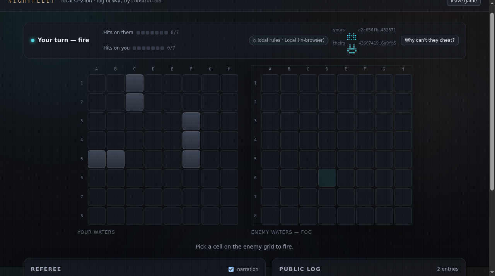
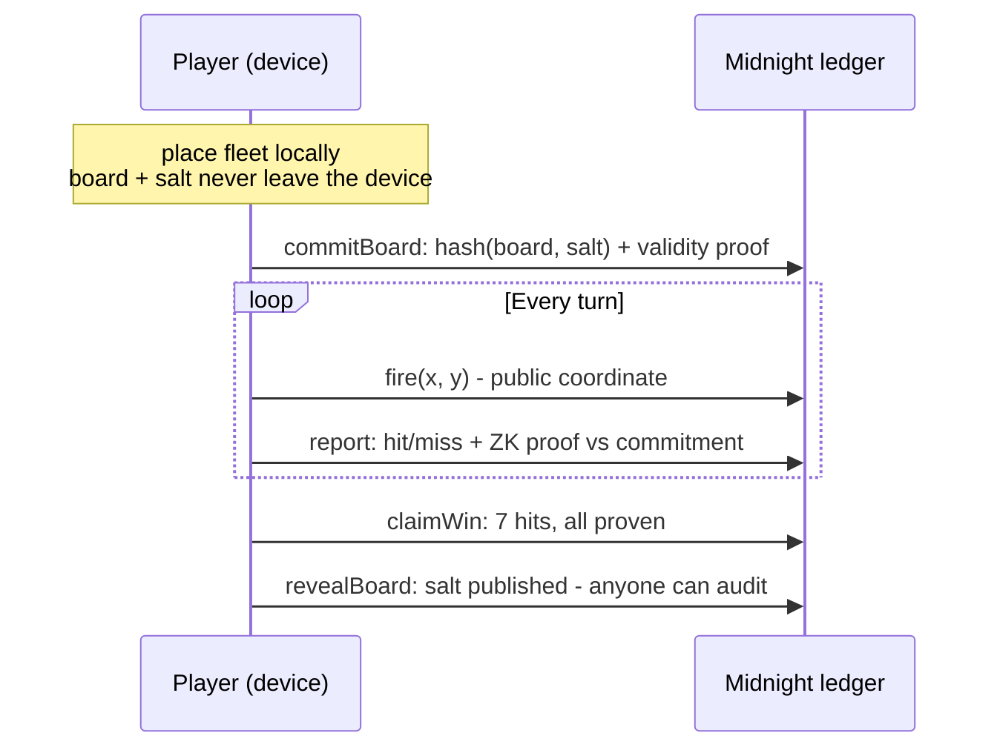
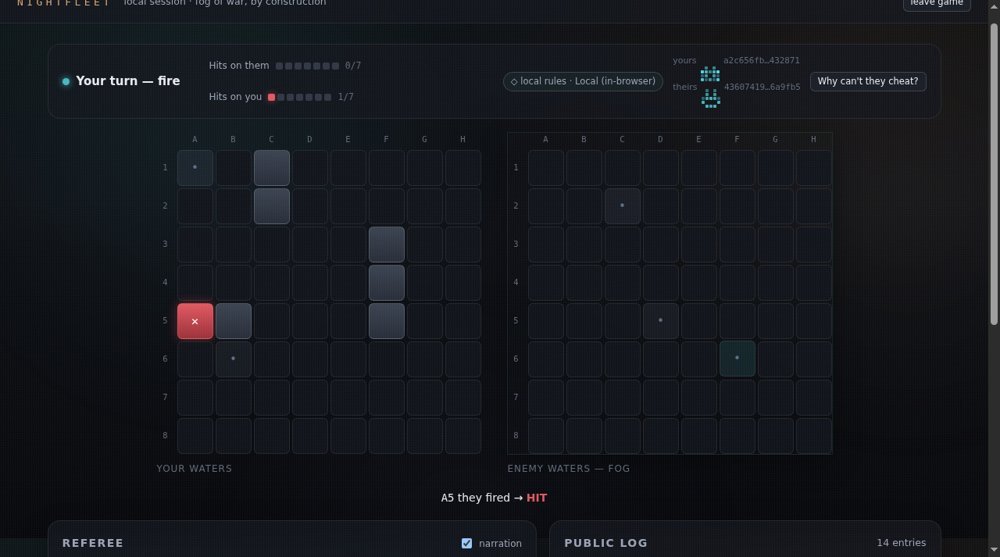

<p align="center"></p>

<h1 align="center">NightFleet</h1>
<p align="center"><strong>Battleship where your fleet is a hash, not a promise.</strong></p>
<p align="center">The first fully playable, provably fair hidden-fleet game on Midnight.</p>

<p align="center">
<a href="https://nightfleet.vercel.app">Play the demo</a> ·
<a href="#section-02--the-disparity">The disparity</a> ·
<a href="#section-04--the-contract">The contract</a> ·
<a href="#section-08--run-it">Run it</a> ·
<a href="ROADMAP.md">Roadmap</a>
</p>

<p align="center"></p>

https://github.com/user-attachments/assets/b82379a0-cbbf-4d8d-baf8-10c8acb8d377


---

Every Battleship turn asks one player a question only they can answer:
*was that a hit?* For seventy years the answer ran on trust. On a game server,
the operator sees both fleets and tells you whatever it likes. On a transparent
blockchain, there is nowhere to hide the fleet at all. Either way, the one
thing the game is about - a secret - is gone.

NightFleet deletes the trust assumption. Your fleet is committed on-chain as
`hash(board, salt)` before the first shot. Every hit-or-miss answer after that
is a zero-knowledge proof checked against that commitment. **Cheating is not
banned. It is mathematically impossible.**

---

## SECTION 01 · THE PROBLEM

Hidden information is the soul of strategy games - and the thing blockchains
were never built to hold. Public ledgers publish everything. Private servers
hide everything, including their own cheating. An entire genre of games has
been locked out of on-chain ownership, real stakes, and trustless play because
nobody could keep one small secret: where the ships are.

## SECTION 02 · THE DISPARITY

| | A game server | A transparent chain | **NightFleet** |
|---|---|---|---|
| Who sees your fleet | The operator | Everyone | **No one** |
| Hit/miss answers | Trust us | Impossible to ask | **Proven, every turn** |
| Move ships mid-game | Undetectable | No fleet to move | **Fails its proof** |
| Verify the winner | Read their database | - | **Audit the chain** |
| The secret lives | In their memory | Nowhere | **In your device, always** |

The gap between "trust us" and "verify it yourself" is the entire product.

## SECTION 03 · HOW IT WORKS



**Private, forever on your device:** fleet layout, board salt, everything not
explicitly disclosed.

**Public, on the ledger:** the commitment hash, turn order, shot coordinates,
hit/miss results.

Three guarantees, enforced by the contract - not by policy:

1. The opening placement is a **valid fleet** (ships `[3, 2, 2]` on an 8x8
   sea, in bounds, non-overlapping) - proven before play begins.
2. Every answer is **consistent with the committed board** - no moved ships,
   no re-commits, no duplicate shots, no out-of-turn play.
3. A win is claimed only on **disclosed, proven hits** - then the salt reveals
   so anyone can audit the whole game.

## SECTION 04 · THE CONTRACT

Six circuits in `contract/src/nightfleet.compact`:

`joinGame` · `commitBoard` · `fire` · `report` · `claimWin` · `revealBoard`

Boards live in private witness state; commitments and results live in public
ledger state. Toolchain pinned: `compactc 0.31.1`,
`@midnight-ntwrk/compact-runtime 0.16.0`. **Preprod only** - the code refuses
mainnet by construction, and real-money wagering is out of scope by policy.

## SECTION 05 · WHAT WE BUILT

Not a slide. A complete, playable system.

| Package | What it does | Proof it works |
|---|---|---|
| `contract/` | The Compact contract: 6 circuits, private witnesses, public commitments | Compiles under pinned `compactc 0.31.1`; 54-case adversarial suite |
| `shared/` | Protocol constants, fleet rules, network presets | 36 tests; refuses mainnet |
| `api/` | `LocalGame`: the full loop in-process, replayable action log | Drives every CLI and browser game |
| `cli/` | A full game in your terminal | `npm run play` - 78 tests |
| `app/` | The browser game | Live at [nightfleet.vercel.app](https://nightfleet.vercel.app) |
| `ai/` | Deterministic opponent (3 tiers) + referee narrator | Plays through the real game API - no fake mode |
| `wallet/` | Lace detection, redaction, Preprod guard | 132 tests |

<p align="center"></p>

## SECTION 06 · ENGINEERING

| Metric | Value |
|---|---|
| Automated tests | **267** across six suites |
| Adversarial contract cases | **54** - every cheat vector fails its proof |
| Circuits | **6** exported, witnesses private |
| AI difficulties | **3** deterministic tiers |
| Cheat vectors covered | moved ships, re-committed boards, duplicate shots, out-of-turn play |

The adversarial suite (`contract/test/nightfleet.adversarial.test.js`) plays
the cheater: move ships after committing, commit twice, fire twice, answer out
of turn - and asserts every attempt fails its proof.

## SECTION 07 · WHY MIDNIGHT

The fleet is not a feature with privacy bolted on - the privacy IS the game.
Compact circuits keep the witness off-chain and put only proofs on the ledger,
which is exactly the shape this problem demands.

And NightFleet gives back more than a game. It is a reference implementation
for every team building private-state consumer apps on Midnight: witness
design, commit-reveal protocols, adversarial test discipline, a deterministic
rules engine shared verbatim between contract, CLI, and browser, and a
Web2-smooth player experience on top of zero-knowledge rails. The patterns
here - how to hide state, prove claims, and keep the UX human - are the
patterns the whole ecosystem needs next.

## SECTION 08 · WHAT'S LIVE

| Component | Status | How to verify |
|---|---|---|
| Game loop (commit -> fire -> report -> win -> reveal) | **LIVE** | `npm run play` in `cli/` - full game vs AI |
| Browser demo | **LIVE** | [nightfleet.vercel.app](https://nightfleet.vercel.app) |
| AI opponent + narrator | **LIVE** | plays through the real game API |
| Contract compilation | **LIVE** | `npm run compile` in `contract/` (pinned compactc) |
| Test suites | **267 passing** | `npm test` per package |
| Preprod deployment | **NEXT** | owner-operated: Docker proof server + Lace + faucet |

The demo runs the same rules engine the contract is written against, in the
page: no wallet, no chain, no proofs. It is the game loop, not the deployment.

## SECTION 09 · RUN IT

```bash
# 1. compile the contract (regenerates the gitignored managed/ assets)
cd contract && npm install && npm run compile && cd ..

# 2. hoist the Midnight runtime once, so every package shares one physical copy
npm run hoist-runtime   # where present; otherwise npm install per package

# 3. install + test each package
for p in shared api ai cli app wallet; do (cd $p && npm install && npm test); done

# 4. play a local game against the AI
cd cli && npm run play

# 5. web app
cd app && npm install && npm run dev
```

## Known limitations

- **Preprod deployment is the next milestone** - the contract compiles and the
  loop is proven locally, but the on-chain deploy awaits owner-run steps
  (Docker proof server, Lace wallet, faucet funds).
- The browser demo proves the game loop, not the chain: proofs are exercised by
  the contract suites, the UI runs the shared rules engine.
- Solo vs AI today; two-player on-chain matches follow the Preprod deploy.

## SECTION 10 · ROADMAP

Shipped, in flight, and next - see [ROADMAP.md](ROADMAP.md).

## License

Apache-2.0. See [LICENSE](LICENSE).
