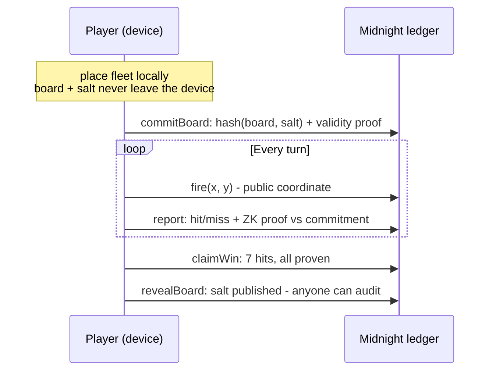

<p align="center"></p>

<h1 align="center">NightFleet</h1>
<p align="center"><strong>Battleship where your fleet is a hash, not a promise.</strong></p>
<p align="center">Provably fair hidden-fleet Battleship on Midnight.</p>

<p align="center">
<a href="https://nightfleet.vercel.app">Live demo</a> ·
<a href="#section-04--the-contract">The contract</a> ·
<a href="#section-06--engineering">Engineering</a> ·
<a href="#section-08--run-it">Run it</a>
</p>

---

Every Battleship turn asks one player to answer "hit or miss?" honestly about
a board the other player cannot see. On a game server you trust the operator
not to peek. On a transparent blockchain the board would be public. Neither
works.

NightFleet's answer: **stop trusting, start proving.** Your fleet is committed
as `hash(board, salt)` before the first shot. Every hit/miss answer is a
zero-knowledge proof against that commitment. Lying is not against the rules -
it is mathematically impossible.

---

## SECTION 01 · THE PROBLEM

Hidden-information games are the canonical zero-knowledge use case, and
Battleship is the cleanest one. The whole game is one private fact: where your
ships are.

- **On a server**, the operator sees both fleets and can feed you any answer.
- **On a transparent chain**, there is nowhere to hide the fleet at all.
- **In NightFleet**, the fleet never leaves your device, and every answer about
  it arrives with a proof.

Privacy is not decoration here. Without it, the game has no honest answer to
give.

## SECTION 02 · WHAT WE BUILT

A complete, playable implementation of the commit-reveal Battleship protocol -
contract, game engine, CLI, browser app, AI opponent, and wallet integration.

| Package | What it does | Proof it works |
|---|---|---|
| `contract/` | The Compact contract: 6 circuits, private board witnesses, public commitments | Compiles under pinned `compactc 0.31.1`; 54-case adversarial suite |
| `shared/` | Network presets, fleet rules, toolchain pins | 36 tests, mainnet-refusal guard |
| `api/` | `LocalGame`: the full loop in-process, replayable action log | Drives every CLI and browser game |
| `cli/` | Play a full game in your terminal | `npm run play` - 78 tests |
| `app/` | The browser game at the demo URL | Live at [nightfleet.vercel.app](https://nightfleet.vercel.app) |
| `ai/` | Deterministic AI opponent (3 tiers) + referee narrator | Plays through the real game API - no fake mode |
| `wallet/` | Lace wallet detection, redaction, Preprod guard | 132 tests; refuses mainnet by construction |

## SECTION 03 · HOW THE PRIVACY WORKS



**Private (never leaves the device):** fleet layout, board salt, everything not
explicitly disclosed.

**Public (on the ledger):** the commitment hash, turn order, shot coordinates,
hit/miss results.

The contract enforces three guarantees:

1. The initial placement is a **valid fleet** (ships `[3, 2, 2]` on an 8x8 sea,
   in bounds, non-overlapping).
2. Every report is **consistent with the committed board** - no moving ships
   mid-game, no re-commits, no duplicate shots, no out-of-turn play.
3. The win condition is proven from **disclosed hits only**.

## SECTION 04 · THE CONTRACT

Six exported circuits in `contract/src/nightfleet.compact`:

`joinGame` · `commitBoard` · `fire` · `report` · `claimWin` · `revealBoard`

Boards live in private witness state; commitments, turns, and results live in
public ledger state. Toolchain is pinned: `compactc 0.31.1`,
`@midnight-ntwrk/compact-runtime 0.16.0`. **Preprod only** - the code refuses
mainnet by construction, and real-money wagering is out of scope by policy.

## SECTION 05 · WHAT'S LIVE

| Component | Status | How to verify |
|---|---|---|
| Game loop (commit -> fire -> report -> win -> reveal) | **LIVE** | `npm run play` in `cli/` - full game vs AI |
| Browser demo | **LIVE** | [nightfleet.vercel.app](https://nightfleet.vercel.app) |
| AI opponent + narrator | **LIVE** | plays through the real game API, 3 difficulties |
| Contract compilation | **LIVE** | `npm run compile` in `contract/` (pinned compactc) |
| Test suites | **267 passing** | `npm test` per package |
| Preprod deployment | **NEXT** | owner-operated: Docker proof server + Lace + faucet |

The demo runs the same rules engine the contract is written against, in the
page: no wallet, no chain, no proofs. It is the game loop, not the deployment.

## SECTION 06 · ENGINEERING

| Metric | Value |
|---|---|
| Automated tests | **267** across six suites |
| Adversarial contract cases | **54** - every cheat vector fails its proof |
| Circuits | **6** exported, witnesses private |
| AI difficulties | **3** deterministic tiers |
| Cheat vectors covered | moved ships, re-committed boards, duplicate shots, out-of-turn play |

The adversarial suite (`contract/test/nightfleet.adversarial.test.js`) plays
the cheater: it tries to move ships after committing, commit twice, fire twice,
answer out of turn - and asserts each attempt fails its proof.

## SECTION 07 · WHY MIDNIGHT

The fleet IS the secret the game is built on - privacy is essential here, not
decorative. Compact circuits keep the private witness off-chain; only proofs
touch the ledger. NightFleet is a small, complete, playable demonstration that
a real consumer game can run on Midnight's private state with a Web2 feel.

## SECTION 08 · RUN IT

```bash
# 1. compile the contract (regenerates the gitignored managed/ assets)
cd contract && npm install && npm run compile && cd ..

# 2. hoist the Midnight runtime once, so every package shares one physical copy
npm run hoist-runtime   # where present; otherwise npm install per package

# 3. install + test each package
for p in shared api ai cli app wallet; do (cd $p && npm install && npm test); done

# 4. play a local game against the AI
cd cli && npm run play

# 5. web app
cd app && npm install && npm run dev
```

## Known limitations

- **Preprod deployment is the next milestone** - the contract compiles and the
  loop is proven locally, but the on-chain deploy awaits owner-run steps
  (Docker proof server, Lace wallet, faucet funds).
- The browser demo proves the game loop, not the chain: proofs are exercised by
  the contract suites, the UI runs the shared rules engine.
- Solo vs AI today; two-player on-chain matches follow the Preprod deploy.

## License

Apache-2.0. See [LICENSE](LICENSE).
