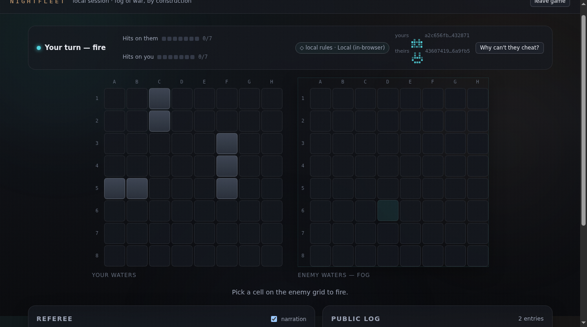
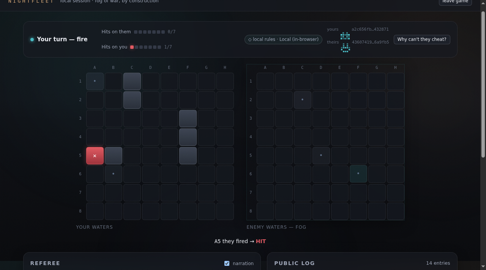
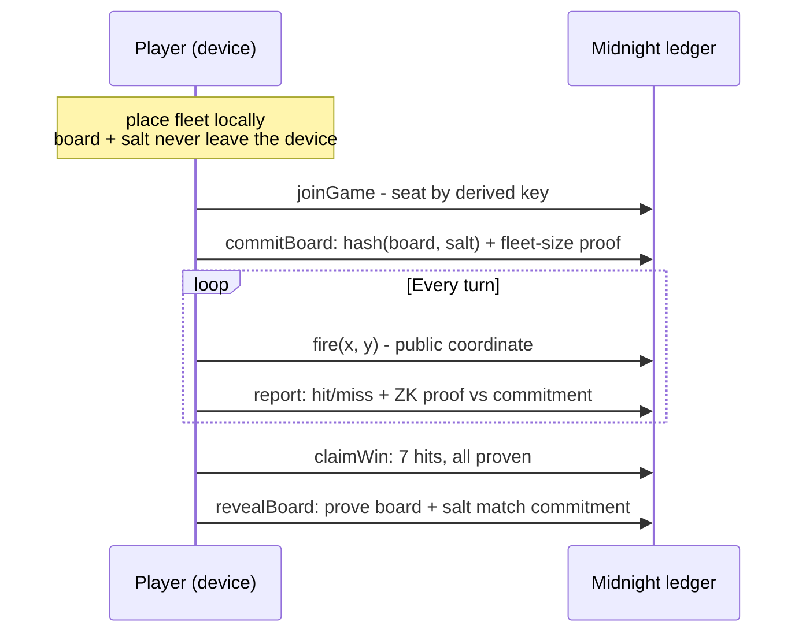
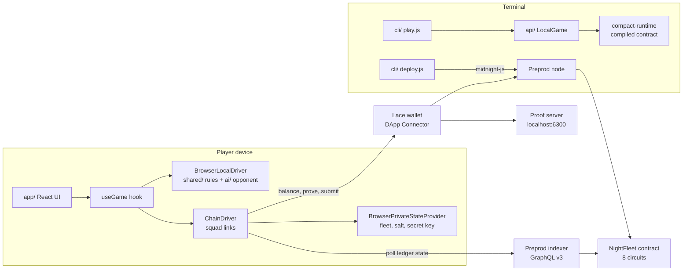

<p align="center"></p>

<h1 align="center">Battleship where your fleet is a hash, not a promise.</h1>
<p align="center"><strong>NightFleet</strong> - the first fully playable, provably fair hidden-fleet game on Midnight.</p>

<p align="center">
<a href="https://nightfleet.vercel.app">Play the demo</a> ·
<a href="#the-problem-we-solve">The problem</a> ·
<a href="#on-chain-contract">The contract</a> ·
<a href="#running-locally">Run it</a> ·
<a href="ROADMAP.md">Roadmap</a>
</p>

<p align="center"></p>

https://github.com/user-attachments/assets/8fa38583-1cd1-4a16-b444-02257f8e7cbc

## Live

| Surface | Link |
|---|---|
| Browser game | [nightfleet.vercel.app](https://nightfleet.vercel.app) |
| Demo video (captioned v3) | [Watch](https://github.com/user-attachments/assets/8fa38583-1cd1-4a16-b444-02257f8e7cbc) · source file in [`video/nightfleet-demo-v3.mp4`](video/nightfleet-demo-v3.mp4) |
| Contract on Midnight Preprod | `15bd24d16878cfc5ee2537223ddd41a13f0ca451c1d64b796a4643b87c94bab6` - [verify via the Preprod indexer](#live-on-preprod) |
| Source | [github.com/Professional50coder/nightfleet](https://github.com/Professional50coder/nightfleet) |
| Roadmap / build log | [ROADMAP.md](ROADMAP.md) · [PROGRESS.md](PROGRESS.md) |

## At a glance

- **The fleet never leaves your device.** It is committed on-chain as `hash(board, salt)`; every hit-or-miss answer is a zero-knowledge proof against that commitment.
- **One Compact contract, eight circuits**, deployed and indexer-confirmed on Midnight Preprod, with a 54-case adversarial suite that plays the cheater.
- **Three ways to play**: in the terminal vs AI, in the browser vs AI, or two players on-chain through a shareable squad link with no game server in between.

## Contents

1. [The problem we solve](#the-problem-we-solve)
2. [Why we built it](#why-we-built-it)
3. [What it does](#what-it-does)
4. [Who it is for](#who-it-is-for)
5. [Product tour](#product-tour)
6. [How it works](#how-it-works)
7. [Architecture](#architecture)
8. [Protocols and intelligence](#protocols-and-intelligence)
9. [Design decisions](#design-decisions)
10. [Feature matrix](#feature-matrix)
11. [Trust, security and limits](#trust-security-and-limits)
12. [Where it stands](#where-it-stands)
13. [Tech stack](#tech-stack)
14. [Repository layout](#repository-layout)
15. [Running locally](#running-locally)
16. [Testing](#testing)
17. [Deploying](#deploying)
18. [Roadmap](#roadmap)
19. [License](#license)

---

## The problem we solve

Every Battleship turn asks one player a question only they can answer:
*was that a hit?* For seventy years the answer ran on trust.

Hidden information is the soul of strategy games - and the thing blockchains
were never built to hold. Public ledgers publish everything. Private servers
hide everything, including their own cheating. An entire genre of games has
been locked out of on-chain ownership and trustless play because nobody could
keep one small secret: where the ships are.

**Who has it.** Players of hidden-information games, and the teams building
them on-chain. **What it costs today.** Either the operator sees both fleets
and you take its word for every answer, or the chain publishes the fleet and
the game is over before it starts.

**The outcome.** NightFleet deletes the trust assumption: cheating is not
banned, it fails its proof.

| | A game server | A transparent chain | **NightFleet** |
|---|---|---|---|
| Who sees your fleet | The operator | Everyone | **No one** |
| Hit/miss answers | Trust us | Impossible to ask | **Proven, every turn** |
| Move ships mid-game | Undetectable | No fleet to move | **Fails its proof** |
| Verify the winner | Read their database | - | **Audit the chain** |
| The secret lives | In their memory | Nowhere | **In your device, always** |

The gap between "trust us" and "verify it yourself" is the entire product.

## Why we built it

Battleship is the smallest game whose entire point is a secret. On a game
server, the operator sees both fleets and tells you whatever it likes. On a
transparent blockchain, there is nowhere to hide the fleet at all. Either way,
the one thing the game is about is gone.

Midnight's Compact circuits keep the witness off-chain and put only proofs on
the ledger - exactly the shape this problem demands. The fleet is not a
feature with privacy bolted on; the privacy is the game.

NightFleet is also meant to give back more than a game. It is a reference
implementation for teams building private-state consumer apps on Midnight:
witness design, commit-reveal protocols, adversarial test discipline, a
deterministic rules engine shared between contract, CLI and browser, and a
Web2-smooth player experience on top of zero-knowledge rails.

It was built for the Midnight Korea hackathon (September 2026). Not a slide:
a complete, playable system.

## What it does

| Capability | Problem it removes |
|---|---|
| Salted board commitment (`commitBoard`) | The opponent or operator learning your layout |
| Proven hit/miss (`report` re-hashes your private board and checks it against the commitment) | Lying about a hit, or moving ships mid-game |
| One shot per cell per player (`shots1`/`shots2` maps) | Firing at one known ship cell seven times to fake a win |
| Win only on 7 reported hits from a seated player (`claimWin`) | Strangers or early claims stealing the win |
| Unanswered-shot forfeit (`startTimeout` / `claimTimeout`) | A losing defender stalling the game forever by walking away |
| Post-game audit (`revealBoard`) | Having to trust that the final board was the committed one |
| Squad links (`#/game/<contract address>`) | Lobbies, accounts and game servers between two players |
| Fog rule in every driver | The UI leaking cells you have not fired at |

## Who it is for

- **Players** who want a hidden-information game where the referee is math.
- **Midnight builders** looking for a worked example of private witnesses, commit-reveal, adversarial contract tests and a browser DApp on Lace.
- **Hackathon judges and reviewers** who want to verify a live deployment in one indexer query.

## Product tour

| Surface | What it proves |
|---|---|
| **Home** (`app/src/components/Home.jsx`) | Pick a backend - *Local (in-browser)* or *Midnight Preprod (proof-backed)* - plus AI difficulty and seed. In on-chain mode, paste a squad link to join or leave it empty to create one. |
| **Fleet setup** (`FleetSetup.jsx`) | 8x8 grid, the `[3, 2, 2]` fleet, click-to-place, <kbd>R</kbd> to rotate, auto-place. Commit stays disabled until `assertValidFleet` from `shared/` passes. |
| **Battle** (`Battle.jsx`, `Hud.jsx`, `ShotLog.jsx`) | Your waters beside the enemy fog. The fog shows only cells you fired at. The HUD says honestly what backs the game: "local rules" vs "proof-backed". |
| **Referee narrator** (`Narrator.jsx`) | One plain-English line per public event: what was proven and what stayed hidden. |
| **Proof inspector** (`Inspector.jsx`) | Splits the game into what went in publicly and what stayed private. Wording follows the driver - the local driver never claims a proof it did not generate. |
| **Result + Reveal & audit** (`Result.jsx`) | The only control that opens a hidden board, gated on the game being finished; checks both boards against their commitments. |
| **Terminal** (`cli/play.js`) | A full game vs AI over the compiled contract, in-process. `fire B3`, `boards`, `log`, `help`, `quit`. |

<p align="center"></p>

More screens: [`screenshots/landing.png`](screenshots/landing.png), [`screenshots/place-fleet.png`](screenshots/place-fleet.png).

Keyboard and screen readers are first-class: every cell is a focusable button
with an ARIA label (`"C4, hit"`), arrow keys move across the grid, hit/miss
carry a glyph as well as a colour, and `prefers-reduced-motion` is honoured.

## How it works

One squad game on Preprod, end to end:

1. **Host.** Player A picks *Midnight Preprod (proof-backed)* and hits **Create squad**. The browser connects Lace, deploys a fresh NightFleet contract, and produces a squad link: the page URL plus `#/game/<64-hex contract address>`. The link carries the address and nothing else.
2. **Join.** Player B opens the link. The app parses the address, connects Lace and binds to the same deployment. `joinGame` seats each player by a key derived from a private secret (`persistentHash("nightfleet:pk", sk)`).
3. **Commit.** Each player places a fleet locally. `commitBoard` asserts both seats are filled, that this seat has not committed before, and that the private board has exactly 7 ship cells, then publishes `hash("nightfleet:board", salt, board)`. When both are committed the phase becomes `PLAYING` and p1 fires first.
4. **Fire.** The attacker calls `fire(x, y)`. The coordinate is public; the contract checks turn, bounds and that this cell has not been fired at, then sets `pendingShot`.
5. **Report.** The defender calls `report`. Inside the circuit the private board is re-hashed and must equal the commitment, the cell is selected by a fixed 64-step mux, and a hit increments the hit counter. Turn flips.
6. **Read back.** Each browser polls the indexer. A cleared `pendingShot` plus a counter delta tells it exactly one cell's result; anything it did not observe stays unknown rather than guessed.
7. **Win.** At 7 hits, the attacker calls `claimWin`. If a defender goes silent on a pending shot, the attacker can arm `startTimeout` and, after at least an hour of chain time, `claimTimeout`.
8. **Audit.** After `FINISHED`, each player can call `revealBoard`, proving the board and salt they now expose match the commitment; the ledger records `revealed1`/`revealed2`.


```mermaid
sequenceDiagram
    participant P as Player (device)
    participant L as Midnight ledger
    Note over P: place fleet locally<br/>board + salt never leave the device
    P->>L: joinGame - seat by derived key
    P->>L: commitBoard: hash(board, salt) + fleet-size proof
    loop Every turn
        P->>L: fire(x, y) - public coordinate
        P->>L: report: hit/miss + ZK proof vs commitment
    end
    P->>L: claimWin: 7 hits, all proven
    P->>L: revealBoard: prove board + salt match commitment
```

**Private, forever on your device:** fleet layout, board salt, secret key, everything not explicitly disclosed.

**Public, on the ledger:** the commitment hashes, seated player keys, turn, shot coordinates, per-player shot sets, hit counters, winner, reveal flags.

Three guarantees, enforced by the contract - not by policy:

1. The opening placement has a **valid fleet size** (exactly 7 ship cells on the 8x8 sea), proven before play begins. Ship shape `[3, 2, 2]`, bounds and overlap are validated client-side by `shared/` before commit; on-chain shape validity is planned (see [Roadmap](#roadmap)).
2. Every answer is **consistent with the committed board** - no moved ships, no re-commits, no duplicate shots, no out-of-turn play.
3. A win is claimed only on **proven hits** by a seated player; afterwards each player can prove their revealed board matches the commitment.

## Architecture


```mermaid
flowchart LR
    subgraph Device["Player device"]
        UI["app/ React UI"]
        HOOK["useGame hook"]
        LD["BrowserLocalDriver<br/>shared/ rules + ai/ opponent"]
        CD["ChainDriver<br/>squad links"]
        PS["BrowserPrivateStateProvider<br/>fleet, salt, secret key"]
        UI --> HOOK
        HOOK --> LD
        HOOK --> CD
        CD --> PS
    end
    LACE["Lace wallet<br/>DApp Connector"]
    PROOF["Proof server<br/>localhost:6300"]
    IDX["Preprod indexer<br/>GraphQL v3"]
    NODE["Preprod node"]
    C["NightFleet contract<br/>8 circuits"]
    CD -->|"balance, prove, submit"| LACE
    LACE --> PROOF
    LACE --> NODE
    NODE --> C
    CD -->|"poll ledger state"| IDX
    IDX --> C
    subgraph Terminal["Terminal"]
        CLI["cli/ play.js"]
        API["api/ LocalGame"]
        RT["compact-runtime<br/>compiled contract"]
        CLI --> API --> RT
        DEP["cli/ deploy.js"] -->|"midnight-js"| NODE
    end
```

### Components

| Package | What it does | Proof it works |
|---|---|---|
| `contract/` | The Compact contract: 8 circuits, private witnesses, public commitments | Compiles under pinned `compactc 0.31.1`; 54-case adversarial suite |
| `shared/` | Protocol constants, fleet rules, network presets, deployment record | 36 tests; refuses mainnet |
| `api/` | `LocalGame`: the full loop in-process over the compiled contract, replayable action log | Drives every CLI game; transcript replay tests |
| `cli/` | A full game in your terminal, plus `deploy.js` for real network deploys | `npm run play` |
| `app/` | The browser game: local driver and the proof-backed `ChainDriver` | Live at [nightfleet.vercel.app](https://nightfleet.vercel.app) |
| `ai/` | Deterministic opponent (3 tiers) + referee narrator | Plays through the real game API - no fake mode |
| `wallet/` | Framework-agnostic Lace detection, redaction, Preprod guard (standalone package; the app currently uses its own `src/chain/lace.js`) | 132 tests |

### The driver seam

The UI never talks to a chain or a rules engine directly. `app/src/hooks/useGame.js`
is the only consumer of a `GameDriver` (`app/src/game/driver.js`), and
`app/src/game/drivers.js` registers two implementations:

| Driver | Backing | Proves moves |
|---|---|---|
| `browser-local` - *Local (in-browser)* | `shared/` rules + `ai/opponent.js`, opponent board held in a `#private` class field | No |
| `midnight-preprod` - *Midnight Preprod (proof-backed)* | `ChainDriver`: Lace + midnight-js, one fresh contract per squad | Yes |

`assertDriverShape` and `test/driver.test.js` run the same conformance block
over every registered driver, and `test/fog-of-war.test.jsx` asserts the fog
rule: the public state never describes a cell you have not fired at.

### On-chain contract

`contract/src/nightfleet.compact` - eight exported circuits:

`joinGame` · `commitBoard` · `fire` · `report` · `claimWin` · `startTimeout` · `claimTimeout` · `revealBoard`

| Ledger field | Meaning |
|---|---|
| `p1`, `p2` | Seated player keys, derived from each player's private secret |
| `commitment1`, `commitment2` | `hash(domain, salt, board)` per player; immutable once set |
| `phase` | `OPEN` → `PLACED_1` / `PLACED_2` → `PLAYING` → `FINISHED` |
| `turn` | Key of the player to move |
| `pendingShot` | The public coordinate awaiting a `report` |
| `timeoutDeadline` | Unix-seconds forfeit deadline, armed by the waiting attacker |
| `hits1`, `hits2` | Hits landed against each player |
| `shots1`, `shots2` | Cells each player has fired at |
| `winner` | Winning key, once set |
| `revealed1`, `revealed2` | Post-game audit flags |

Witnesses (private, off-chain): `localSecretKey`, `myBoard` (64 cells of 0/1), `mySalt`.

Toolchain pinned: `compactc 0.31.1`, `@midnight-ntwrk/compact-runtime 0.16.0`.
**Preprod only** - the code refuses mainnet by construction, and real-money
wagering is out of scope by policy.

### Live on Preprod

The NightFleet contract is deployed and confirmed on the Midnight Preprod test network.

**Contract address**

```
15bd24d16878cfc5ee2537223ddd41a13f0ca451c1d64b796a4643b87c94bab6
```

**Verify it in one step** - query the public preprod indexer
(`https://indexer.preprod.midnight.network/api/v3/graphql`):

```graphql
query {
  contractAction(address: "15bd24d16878cfc5ee2537223ddd41a13f0ca451c1d64b796a4643b87c94bab6") {
    __typename
  }
}
```

The answer is `ContractDeploy` - the contract exists on-chain, deployed from
this repository. No explorer account, no trust in us: the indexer is the
network's own read API.

**Reproduce the deployment yourself** - `cli/deploy.js` runs the full path:
generates a wallet, registers for dust, builds the unproven deploy transaction
with midnight-js, submits it, and confirms via the indexer. Every receipt is
written to [`shared/deployments.json`](shared/deployments.json) (this one:
`2026-09-25T07:13:45.599Z`, `midnight-js@4.1.1`).

A second deployment, `dbe8eec1913fb558850483788b09d4409970e75c5538d920e6ffb0d66de91a79`,
was used for the two-seat end-to-end run recorded in [PROGRESS.md](PROGRESS.md).

### APIs

- **`api/` `LocalGame`** - `create()`, `addPlayer(name)`, `commitBoard(handle, board, salt?)`, `fire(handle, {x, y})`, `report(handle)` → `'hit' | 'miss'`, `claimWin(handle)`, `revealBoard(handle)`, `state()`, `shotLog()`, `LocalGame.replay(log)`. Contract reverts surface as `GameError` with the on-chain assert text. See [api/README.md](api/README.md).
- **`wallet/` `createLaceConnector()`** - five-state connection machine, `getSigner()` only when connected and network-verified. See [wallet/README.md](wallet/README.md).
- **`app/src/chain/`** - `deployNightfleet`, join/call helpers, `squadLinkFor` / `parseSquadLink`, `createBrowserProviders`.

## Protocols and intelligence

| What | Where | Why |
|---|---|---|
| Zero-knowledge circuits (Compact on Midnight) | `contract/` | Keep the board as a private witness and put only proofs and commitments on the ledger |
| Salted hash commitment (`persistentHash`) | `boardCommit` | Bind each player to one board for the whole game without revealing it |
| Bounded 64-step mux (`fold` over the grid) | `cellAt` | Read one cell at a public index with a fixed-shape, ZK-friendly loop - no dynamic indexing |
| Bracketed block-time deadline | `startTimeout` / `claimTimeout` | Compact 0.31.1 can compare against the clock but not read it; the claimant supplies a deadline the contract pins to `[now + 1h, now + 7d]`. Full reasoning in [contract/README.md](contract/README.md#liveness-the-unanswered-shot-forfeit) |
| Midnight DApp Connector (Lace) | `app/src/chain/` | The wallet balances, proves and submits; the app hosts no key material |
| Deterministic AI opponent | `ai/opponent.js` | `easy` (random), `medium` (parity hunt, then target + line-follow), `hard` (probability density over remaining fleet shapes). Seeded, so a seed replays a game exactly |
| Referee narrator | `ai/narrator.js` | Template line per public event. An optional LLM client (`generate(systemPrompt, publicInput)`) can be injected; on error or deadline it falls back to the template. No LLM is in the move path, and the app uses the template path only |

The narrator is private by construction: only whitelisted public events
(`commit`, `fire`, `report`, `win`) are narratable, unknown types throw, and
only whitelisted fields are ever passed to a model.

## Design decisions

| Decision | Why | Trade-off |
|---|---|---|
| One rules module (`shared/`) used verbatim by CLI, browser and AI, mirroring the contract constants | Contract, terminal and browser cannot drift on what a legal fleet is | Constants must be kept in sync with the `.compact` file by hand |
| A driver seam between UI and backend | Local and proof-backed play share every component; the fog and conformance tests apply to both | Every driver method is async, even when the local one resolves instantly |
| One fresh contract deployment per squad | The contract address is the lobby; no server, account system or matchmaker | Each game pays a deploy, and there is no open-games list yet |
| Split forfeit into `startTimeout` + `claimTimeout` with a 1-hour grace | `fire` keeps its signature; the defender's window starts when the attacker complains; an honest slow defender cannot lose a race | Other stalls (never committing, never firing) are not yet covered; a timeout always produces a winner, no draw |
| Fleet-size validity on-chain, shape validity client-side | Keeps the commit circuit cheap to prove | A modified client could commit a 7-cell board that is not `[3, 2, 2]`; full shape validity is planned |
| Browser private state in `localStorage` | Matches how browser DApps on Midnight hold session state; the wallet keeps the money keys | Not encrypted at rest, unlike the CLI's LevelDB store - documented in `app/src/chain/private-state.js` |

## Feature matrix

| Area | Feature | Status |
|---|---|---|
| **Contract** | Join, commit, fire, report, claim win | Built, tested |
| | Duplicate-shot, re-commit, out-of-turn, stranger guards | Built, tested |
| | Unanswered-shot forfeit | Built, tested |
| | Post-game reveal | Built, tested |
| | On-chain ship-shape validity | Planned |
| **Play** | Terminal vs AI (`npm run play`, `npm run demo`) | Live |
| | Browser vs AI | Live |
| | Two-player squad links on Preprod | Built; e2e verified through `fire` (see limits) |
| | Lobby, spectator mode, tournaments | Planned |
| **AI** | 3 deterministic difficulty tiers | Live |
| | Template narrator; optional LLM narration with fallback | Live (template in app) |
| **Wallet** | Lace detection and connect (app) | Built |
| | Preprod guard, mainnet refusal, address redaction (`wallet/`) | Built, mock-tested |
| **Ops** | CLI deploy with dry run, receipts, distinct exit codes | Used for the Preprod deploy |
| | Vercel build with zk-asset staging | Live |
| **Accessibility** | Keyboard grid, ARIA labels, reduced motion | Live |

## Trust, security and limits

**Testnet only.** Everything runs on Midnight Preprod or locally. The code
refuses mainnet by construction (`shared/network.js`, `wallet/`), and
real-money wagering is out of scope by policy, permanently.

**What the browser game vs AI proves.** The *Local (in-browser)* driver runs
the same shared rules engine in the page: no wallet, no chain, no proofs. It
is the game loop, not the deployment, and the HUD says so. Proofs are
exercised by the contract suites and by the squad-link driver.

**Squad links status.** The two-player chain layer, proof-backed driver and UI
are built. On 2026-09-27 a two-seat run on Preprod (contract
`dbe8eec1...de91a79`) completed deploy, both joins, both commits, and a
`fire` that landed as a confirmed hit; the final `report` settlement was
attempted repeatedly and blocked by Preprod infrastructure instability in the
submit phase ([PROGRESS.md](PROGRESS.md)). A full on-chain game to `claimWin`
has not yet been recorded.

**Known gaps, stated plainly.**

- Ship shape is not proven on-chain; only the 7-cell count is.
- The forfeit covers an unanswered shot only. A player who never commits, or never fires on their turn, can still park a game.
- A timeout always produces a winner; there is no draw path.
- Browser private state (fleet, salt, secret key) is unencrypted `localStorage`, readable by any script on the origin.
- `wallet/` is tested against a mock injected provider built from the published connector types, not yet against a real Lace extension.
- The ledger does not publish per-cell results; the chain driver learns each result by watching a `pendingShot` → counter transition, and marks cells it did not observe as unknown.
- Block time is accurate to block scale, and a block producer supplies it within consensus bounds; the one-hour grace is chosen to make this irrelevant.

**Secrets.** `cli/deploy.js` reads the wallet seed from `NIGHTFLEET_WALLET_SEED`
at signing time only; it is never written to `deployments.json` or printed.
`.env`, `*.seed`, `*.key` and `wallet-*.json` are gitignored.

## Where it stands

Hidden-information games have generally had two options: a trusted server that
can see both sides, or a public chain that can see everything. NightFleet sits
in the gap - private state on the player's device, every claim about it
proven, the whole game auditable from public ledger state. It is small on
purpose: one contract, one fleet, one grid, but with an adversarial test suite,
a liveness fix grounded in what the pinned compiler actually supports, and a
Web2-grade interface on top.

## Tech stack

| Layer | Choice |
|---|---|
| Smart contract | Compact (language 0.23), compiler `0.31.1`, devtools `0.5.1` |
| Contract runtime | `@midnight-ntwrk/compact-runtime 0.16.0`, `@midnight-ntwrk/onchain-runtime-v3 ^3.0.0`, `@midnight-ntwrk/ledger-v8 ^8.1.0` |
| Chain client | midnight-js `4.1.1` (contracts, indexer public data, fetch zk-config, dapp-connector proof provider, network id, utils) |
| Wallet | Lace via `@midnight-ntwrk/dapp-connector-api ^4.0.1` |
| Proof server | Docker `midnightntwrk/proof-server:8.1.0` on `localhost:6300` |
| Frontend | React 18.3.1, Vite 6, hand-written CSS with design tokens |
| Tests | Vitest 3.2.4, Testing Library, jsdom |
| Runtime | Node 20+, plain ESM JavaScript |
| Hosting | Vercel (Git-connected to `main`) |

## Repository layout

```
nightfleet/
├── contract/         Compact contract + adversarial tests (managed/ is generated, gitignored)
│   └── src/nightfleet.compact
├── shared/           rules, constants, network presets, deployments.json
├── api/              LocalGame - in-process game over the compiled contract
├── cli/              play.js (terminal game), deploy.js (network deploy)
├── ai/               opponent.js, narrator.js, game-player.js
├── app/              React + Vite browser game
│   ├── scripts/prepare-chain.mjs   stages compiled contract + zk keys for the bundle
│   └── src/
│       ├── game/     driver seam, local driver, placement, protocol
│       ├── chain/    ChainDriver, Lace, providers, private state, squad links
│       ├── components/
│       └── hooks/
├── wallet/           standalone Lace connector package
├── brand/ screenshots/ video/
├── ROADMAP.md  PROGRESS.md  LICENSE
```

## Running locally

Prerequisites: Node 20+, npm, and the Compact toolchain at `0.31.1`
(`compact update +0.31.1` via the midnight-devtools installer).

```bash
# 1. compile the contract (regenerates the gitignored managed/ assets)
cd contract && npm install && npm run compile && cd ..

# 2. hoist the Midnight runtime once, so every package shares one physical copy
npm run hoist-runtime   # where present; otherwise npm install per package

# 3. install + test each package
for p in shared api ai cli app wallet; do (cd $p && npm install && npm test); done

# 4. play a local game against the AI
cd cli && npm run play

# 5. web app
cd app && npm install && npm run dev
```

There is no root `package.json` in this repository, so step 2 falls back to
installing per package. The app serves on `http://localhost:5173`. Its
`predev` / `prebuild` / `pretest` hooks run `prepare:chain`, which stages the
compiled contract from `contract/managed/` or, if that is absent, downloads the
`zk-assets` release tarball from this repository.

The CLI also has a deterministic scripted game: `cd cli && npm run demo`
(`node play.js --demo`).

**To play on-chain (squad links), each player needs:**

- Chrome with the [Lace](https://www.lace.io) wallet extension (Midnight
  network support), funded with preprod tNIGHT from the
  [faucet](https://midnight-tmnight-preprod.nethermind.dev/)
- A local proof server, which Lace proves against:
  `docker run -p 6300:6300 midnightntwrk/proof-server:8.1.0 midnight-proof-server -v`

Then choose *Midnight Preprod (proof-backed)* on the home screen and **Create
squad**, or open a squad link to join. The deployed game lives at its contract
address - anyone can audit the turns through the indexer, and nobody,
including us, can see either fleet.

## Testing

Each package runs Vitest: `npm test` (or `npx vitest run`) inside the package.

| Suite | Covers |
|---|---|
| `contract/` | 54 cases: full happy-path games to `claimWin` and reveal; must-revert cases (double join, re-commit, wrong fleet size, out-of-range coordinates, duplicate shots, firing before commit, reporting on your own board, premature `claimWin`, dishonest `revealBoard`); liveness cases driven by a controlled block clock |
| `shared/` | 36 tests: rules, coordinates, network presets, mainnet refusal |
| `api/` | Full game, commitment determinism, transcript replay, reveal flow |
| `ai/` | Opponent tiers and determinism, narrator guardrails and fallback, full games through `LocalGame` |
| `cli/` | Scripted game to a winner, duplicate-shot rejection, rendering; deploy config, failure modes, dry run, mock-provider deploy flow |
| `app/` | Placement, driver conformance, fog of war, components, hooks, battle, chain and chain-driver projection, performance |
| `wallet/` | 132 tests across 8 files, all against a mock injected provider |

The adversarial suite (`contract/test/nightfleet.adversarial.test.js`) plays
the cheater - move ships after committing, commit twice, fire twice, answer
out of turn - and asserts every attempt fails its proof.

Order matters: compile the contract first. `api/`, `cli/test/engine.test.js`
and `app/` (via `prepare:chain`) need `contract/managed/`;
`cli/test/deploy.test.js` runs on a bare clone. The hackathon submission
recorded **267 passing tests** across six suites; suites have grown since, so
run `npm test` per package for the current count.

## Deploying

**Web app (Vercel).** The repository is imported into Vercel, Git-connected to
`main` and auto-deployed on push, serving
[nightfleet.vercel.app](https://nightfleet.vercel.app). The build runs
`npm run build` in `app/`; `prebuild` stages the compiled contract and zk keys
into `src/vendor/` and `public/zk/`, downloading the `zk-assets` release since
the Compact toolchain is not installed on the build host. Output goes to
`app/dist/`.

**Contract (CLI).** `cli/deploy.js` deploys the compiled contract and records
the contract address and deploy receipt:

```sh
node deploy.js --dry-run                        # validate everything, deploy nothing
node deploy.js --network local   --confirm      # midnight-local-dev stack
node deploy.js --network preprod --confirm      # Preprod (the submission target)
```

A bare `node deploy.js` is a dry run; a real deploy requires `--confirm`.
Exit codes: `2` config, `3` missing artifacts, `4` no wallet, `5` not
confirmed, `6` deploy failed. Configuration comes from the environment only
(`NIGHTFLEET_NETWORK`, `NIGHTFLEET_NODE_URL`, `NIGHTFLEET_INDEXER_URL`,
`NIGHTFLEET_PROOF_SERVER_URL`, secret `NIGHTFLEET_WALLET_SEED` and
`NIGHTFLEET_PRIVATE_STATE_PASSWORD`, and others) - see
[cli/README.md](cli/README.md#deploy). Keep secrets in `.env`, which is
gitignored.

**Squad games** need no operator deploy: the host's browser deploys a fresh
contract per game.

## Roadmap

Planned, from [ROADMAP.md](ROADMAP.md) and the package docs:

1. **On-chain two-player matches** - finish the squad-link end-to-end run through `report`, `claimWin` and reveal on Preprod.
2. **Multiplayer lobby** - open games list, rematch flow, player handles resolved through Lace.
3. **Spectator mode** - watch a live match from public ledger state without ever seeing a fleet until reveal.
4. **Tournament brackets** - commit-reveal seeded brackets audited on-chain.
5. **Contract hardening** - on-chain ship-shape validity, and a generic "player we are waiting on has gone quiet" clock covering missed commits and missed fires.
6. **Later** - mobile-first PWA, a replay explorer that verifies a finished game's board against its commitment, and a reference-implementation track of docs and templates for private-state apps on Midnight.

Hard boundaries that will not change: Preprod/testnet only, no real-money
wagering, and no feature that moves fleet data off the player's device before
reveal.

## License

Apache-2.0. See [LICENSE](LICENSE).
